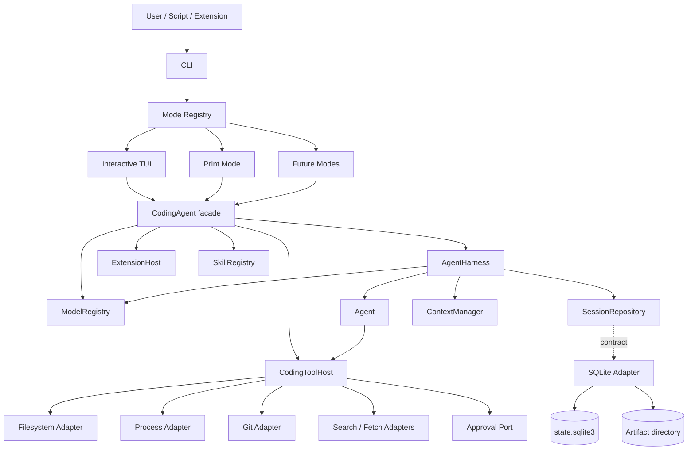
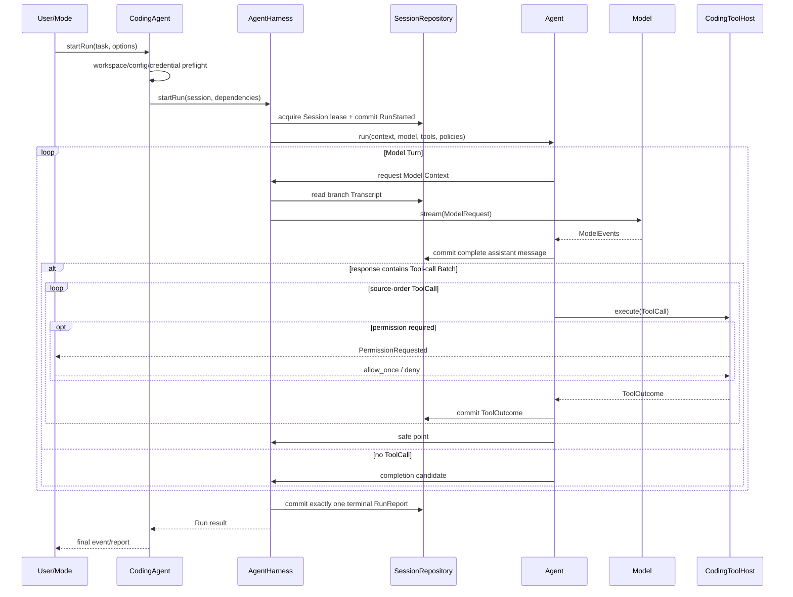

# Coding Agent 架构设计

> 目的：定义第一版及后续演进共同遵守的 package、Module、Interface、Seam、Adapter、目录、依赖和状态所有权。  
> 配套文档：[detailed-design.md](detailed-design.md) 给出包内接口与行为契约。
> Runtime/TUI 决策补充：[opentui-bun-development-plan.md](opentui-bun-development-plan.md) 已确定 Bun + OpenTUI；本文中与旧 runtime/terminal framework 相关的历史实现不得覆盖该补充决定。

## 1. 设计结论

项目采用 Bun workspaces 管理四个 production packages：

```text
packages/
├── model/
├── agent/
├── coding/
└── sqlite/
```

项目 owner 已在 M5.3 的 N1 决策中确认品牌名为 “Dex Code”、CLI executable 为 `dex`。用户可见 config/env/data identity 使用 `DEX_*`、`.dex`、`dex` 与 Windows `Dex Code` 目录；`@coding-agent/*`、`CodingAgent` 等继续作为技术 namespace，不要求随品牌改名。完整记录见 [m53-tui-design-baseline.md](./m53-tui-design-baseline.md)。

三层主干为：

```text
model → agent → coding
```

其中箭头在上图中表示能力逐层被使用；落实到 import 方向则是：

```text
agent  ──imports──> model
sqlite ──imports──> agent
coding ──imports──> model + agent + sqlite
```

- `model` 统一模型 API、provider、auth、model catalog、streaming 与错误语义。
- `agent` 提供通用 `Agent`、production `AgentHarness`、Session contract、context/compaction、tool protocol、Run 生命周期与事件。
- `coding` 把通用 Agent 具体化为本地 coding agent，提供 CLI、modes、TUI、workspace tools、安全策略、skills 与 extension/plugin system。
- `sqlite` 实现 `agent` 拥有的 Session persistence contract，并封装 SQLite schema、migration、transaction、writer lease、recovery 与 Artifact metadata。

第一版的目标是“范围收敛但工程完整”，不是 demo：必须存在真实 provider、完整 multi-turn agent loop、可靠本地工具、安全控制、持久 Session、基础上下文压缩、可用 CLI/TUI、扩展机制和确定性测试。后续能力通过既有 Interface 加深或增加 Adapter，不要求调用者依赖临时实现细节。

## 2. 设计原则

### 2.1 深模块优先

每个 package 和主要 Module 必须用较小的 Interface 隐藏真实复杂性。文件数量、目录层级和 Interface 数量不是技术深度指标。

- `model` 隐藏 provider wire protocol、流式归约、认证和能力差异。
- `agent` 隐藏 Run 状态机、tool-call pairing、context derivation、Session 提交顺序和 terminal 语义。
- `coding` 隐藏 workspace 工具安全、交互模式、插件加载和产品配置。
- `sqlite` 隐藏 SQL schema、migration、事务、并发 lease 与恢复。

只有存在真实替换需求或外部依赖边界时才建立 Seam。内部 helper 不因为方便测试就自动升级为 public Interface。

### 2.2 Interface 由使用方拥有

- `model` 拥有 canonical `Model` contract，provider adapters 实现它；`agent` 只消费该 contract，不重新定义同义协议。
- `agent` 拥有自己消费的 `ToolExecutor`、`SessionRepository`、`ContextSource` 和 policy contract。
- `sqlite` 实现 `agent` 定义的 Session contract，不能让 SQL row type 进入 `agent`。
- `coding` 定义 filesystem、process、Git、approval、HTTP 等内部 ports，并提供 production adapters。
- modes 只消费 `coding` 的 application facade，不直接操作 provider、Agent internals 或数据库。

### 2.3 状态单一所有者

同一事实只允许一个 owner。其他 Module 通过命令、查询或不可变事件观察，不共同修改状态。

### 2.4 第一版不固化阶段性限制

- “第一版”描述实施顺序，不进入 package、class 或 protocol 名称。
- 第一版首先实现 interactive TUI，不把 TUI 写成唯一 frontend。
- 第一版实现基础 compaction，不把当前算法写死进 Session schema 或 Agent loop。
- 第一版不实现完整 memory、Task/Subagent 系统，但 context pipeline、Harness、tool registry 和 Session contract 允许后续能力接入。
- 第一版只实现少量 provider/auth/backend Adapter，但保留稳定 registry 与 contract。

### 2.5 扩展服从核心不变量

Extensions 可以增加 tools、commands、modes、skills、context contributions 和 provider registrations，但不能绕过 Hard Guard、伪造 Session 事实、产生第二套 terminal 语义或直接修改 Agent 内部状态。

## 3. 总体架构



### 3.1 主执行流



这里的 “exactly one terminal” 指每个已经建立的 Run 恰好进入一次 terminal state、产生一个 terminal event 和一个 `RunReport`，与用户打开多少个终端窗口无关。一个 Session 同时最多一个 active Run；不同 Session 是否并发由 application policy 和资源预算决定，架构不使用进程级全局单例禁止多终端。

## 4. Package 边界

### 4.1 `packages/model`

`model` 是 provider-neutral 的模型访问层。它不认识 Session、Agent loop、coding tools、TUI 或 SQLite。

主要职责：

- canonical message、content part、tool definition、tool call/result 类型；
- `Model`、`ModelProvider`、`ModelRegistry` 与 model catalog；
- OpenAI-compatible 和 Anthropic native provider adapters；
- streaming event grammar 与完整 response accumulator；
- provider capabilities 和 request validation；
- auth/credential resolution；
- provider error、usage、finish reason 归一化；
- production/fake 共用的 provider contract tests。

它隐藏 provider SDK 类型和 wire payload。任何 provider-specific request/response 都不得越过 `model` 的 public API。

### 4.2 `packages/agent`

`agent` 是通用 Agent 层。它依赖 `model`，但不认识 coding workspace、shell、Git、OpenTUI 或 SQLite。

主要职责：

- `Agent`：一次 Run 内的 multi-turn model ↔ tool loop；
- `AgentHarness`：production Session-aware orchestration，不是仅供测试的 helper；
- Run 状态机、stop/retry/abort 与 exactly-once terminal；
- Tool-call Batch、call/result pairing 和 safe point；
- Session、Conversation Branch、Transcript、Run、RunReport contract；
- `SessionRepository` 和 `RunLease` persistence seams；
- Model Context projection、`ContextSource` pipeline、budget 与基础 compaction；
- semantic/progress events、hooks 与 observability contract；
- deterministic in-memory adapters 和 conformance suites。

`Agent` 与 `AgentHarness` 的边界：

- `Agent` 只拥有单次 active Run 的执行状态，不持有跨 Run persistence。
- `AgentHarness` 负责把 `Agent` 接入 Session、context、model、tools、policies 和 durable event commit。
- `coding` 只通过 `AgentHarness` 组装产品流程，不复制 agent loop。

### 4.3 `packages/coding`

`coding` 是产品层和 composition root。它把 `model`、`agent`、`sqlite` 以及本地 OS adapters 组合为可运行 coding agent。

主要职责：

- `CodingAgent` application facade 和 `CodingSession`；
- CLI 参数、配置加载、启动诊断和进程退出语义；
- `InteractionMode` registry；第一版实现 interactive TUI 和 print mode；
- 基于 OpenTUI Core、OpenTUI Solid 和 OpenTUI Keymap 的 terminal presentation；
- workspace discovery、Git baseline/fingerprint；
- coding tool registry 与 `CodingToolHost`；
- filesystem、process、Git、web search/fetch adapters；
- Hard Guard、Permission Mode、approval correlation 和 Secret Registry；
- extension/plugin loader、manifest、compatibility 与 lifecycle；
- skill discovery、selection、context contribution；
- product resources、prompts、themes 和用户配置。

`coding` 可以依赖其余三个 packages；其他 packages 禁止依赖 `coding`。

### 4.4 `packages/sqlite`

`sqlite` 是 `agent` persistence contract 的 production adapter，不是第四层业务逻辑。

主要职责：

- SQLite connection lifecycle 和 pragmas；
- versioned migrations；
- `SessionRepository`、writable Session 和 `RunLease` 实现；
- Session/Branch/Transcript/Run/queue/context metadata persistence；
- transaction、revision、writer lease 和多进程冲突检测；
- crash recovery、integrity checks 与 read-only degraded mode；
- Artifact metadata 与本地 content-addressed byte store 的协调；
- SQLite 与 in-memory backend 共用的 conformance tests。

`sqlite` 只依赖 `agent` 的 public persistence contract，不依赖 `coding` 或 TUI。

## 5. Proposed Directory Tree

```text
/
├── package.json                       # private workspace root；只负责编排 scripts/workspaces
├── bun.lock                           # 唯一 dependency lock
├── tsconfig.json                      # workspace typecheck/project references
├── tsconfig.base.json                 # packages 共用 TypeScript 规则
├── biome.json                         # lint/format/import 规则
├── CONTEXT.md                         # 领域语言
├── packages/
│   ├── model/
│   │   ├── package.json               # @coding-agent/model
│   │   ├── src/
│   │   │   ├── api/                   # canonical request/message/event/error/capability API
│   │   │   ├── providers/             # provider registry 与 production adapters
│   │   │   │   ├── openai-compatible/ # OpenAI-compatible wire implementation + profiles
│   │   │   │   └── anthropic/         # Anthropic Messages wire implementation
│   │   │   ├── auth/                  # credential contracts、env/file sources、redacted refs
│   │   │   ├── catalog/               # model metadata、capabilities 与 resolution
│   │   │   ├── streaming/             # event validation、accumulation、abort/failure normalization
│   │   │   ├── errors/                # stable model error taxonomy
│   │   │   ├── testing/               # scripted model 与 provider conformance utilities
│   │   │   └── index.ts               # intentional public exports
│   │   └── test/                       # canonical + raw-wire contract tests
│   │
│   ├── agent/
│   │   ├── package.json               # @coding-agent/agent
│   │   ├── src/
│   │   │   ├── agent/                 # per-Run Agent、state machine、turn/batch execution
│   │   │   ├── harness/               # production AgentHarness、commit barriers、RunHandle
│   │   │   ├── session/               # Session domain、Repository/RunLease contracts
│   │   │   ├── context/               # ContextManager、ContextSource pipeline、budget/manifest
│   │   │   ├── compaction/            # CompactionStrategy 与第一版基础实现
│   │   │   ├── tools/                 # generic ToolDefinition/Executor/Outcome protocol
│   │   │   ├── policies/              # stop/retry/budget policies
│   │   │   ├── events/                # semantic/progress events 与 event delivery
│   │   │   ├── hooks/                 # constrained lifecycle hooks；不含 dynamic plugin loader
│   │   │   ├── errors/                # agent/session/context error taxonomy
│   │   │   ├── testing/               # in-memory repository、manual clock、scenario helpers
│   │   │   └── index.ts               # public exports；internal types 不泄漏
│   │   └── test/                       # loop/session/context/harness conformance tests
│   │
│   ├── coding/
│   │   ├── package.json               # @coding-agent/coding；包含 CLI bin
│   │   ├── src/
│   │   │   ├── app/                   # CodingAgent facade、CodingSession、product events
│   │   │   ├── cli/                   # argv、commands、exit codes、startup diagnostics
│   │   │   ├── modes/
│   │   │   │   ├── registry.ts        # InteractionMode registry
│   │   │   │   ├── interactive/       # OpenTUI TUI、view reducer、components、input mapping
│   │   │   │   └── print/             # non-interactive single-task/stdout mode
│   │   │   ├── workspace/             # repository discovery、baseline、fingerprint、leases
│   │   │   ├── tools/
│   │   │   │   ├── host/              # plan→guard→approval→execute→cleanup pipeline
│   │   │   │   ├── files/             # list/read/search/create/patch/replace/delete
│   │   │   │   ├── process/           # PowerShell/Bash execution and cleanup
│   │   │   │   ├── git/               # status/diff evidence
│   │   │   │   └── web/               # search/fetch, DNS/redirect/SSRF controls
│   │   │   ├── permissions/            # Permission Mode、ApprovalPort bridge、Hard Guards
│   │   │   ├── extensions/             # manifest、loader、registry、API compatibility
│   │   │   ├── skills/                 # skill sources、registry、selection、rendering
│   │   │   ├── config/                 # layered non-secret config and validation
│   │   │   ├── resources/              # built-in prompts、skills、themes、schemas
│   │   │   ├── composition/            # 唯一 production object graph construction
│   │   │   ├── errors/                 # product/startup/CLI error mapping
│   │   │   └── index.ts                # embedding API
│   │   ├── test/                        # app/tool/mode/extension/skill tests
│   │   └── bin/                         # minimal executable entry
│   │
│   └── sqlite/
│       ├── package.json                 # @coding-agent/sqlite
│       ├── src/
│       │   ├── connection/              # database factory、pragmas、transactions
│       │   ├── repository/              # SessionRepository/Session/RunLease adapters
│       │   ├── schema/                  # SQL row types kept private
│       │   ├── migrations/              # ordered immutable migrations
│       │   ├── storage/                 # entries、branches、runs、queues、context、leases
│       │   ├── artifacts/               # metadata + content-addressed local bytes
│       │   ├── recovery/                # orphan Run、integrity、degraded open
│       │   ├── testing/                 # temp DB fixtures and conformance factory
│       │   └── index.ts                 # adapter constructors only
│       └── test/                         # migration/transaction/recovery/conformance tests
│
├── test/
│   ├── integration/                     # four-package production-path scenarios
│   ├── system/                          # real process/filesystem/SQLite crash/platform tests
│   ├── acceptance/                      # real coding tasks、external verifier、evidence
│   └── fixtures/                        # canonical model/tool/task/wire fixtures
├── scripts/                              # build、fresh-checkout、evidence、release helpers
├── examples/                             # embedding、extension、skill examples
└── docs/                                 # specifications、architecture、decisions、delivery docs
```

目录表示稳定职责，不要求每个类型单独建文件。实现时可以在不改变 package boundary 和依赖规则的前提下合并小文件。

## 6. 逻辑 Module 到 Package 的映射

| Module | Package | Interface | 隐藏复杂性 |
| --- | --- | --- | --- |
| Model Access | `model` | `ModelRegistry`、`ModelProvider`、`Model` | provider/auth/catalog/wire/streaming/errors |
| Agent Core | `agent` | `Agent.run()` | state machine、turn/attempt、batch、retry/abort/terminal |
| Agent Harness | `agent` | `AgentHarness.startRun()`、`RunHandle` | Session commit、context、queues、hooks、RunReport |
| Session Domain | `agent` | `SessionRepository`、`SessionHandle`、private `RunLease` | tree、Transcript、branch、cross-Run invariants |
| Context Management | `agent` | `ContextManager`、`ContextSource`、`CompactionStrategy` | budget、selection、provenance、compaction |
| Coding Application | `coding` | `CodingAgent`、`CodingSession` | product use cases、preflight、configuration、event projection |
| Coding Tool Host | `coding` | implements `ToolExecutor` | validation、plan、Hard Guard、approval、OS adapters、cleanup |
| Interaction Modes | `coding` | `InteractionMode`、`ModeRegistry` | TUI/print lifecycle、input/output mapping |
| Extension Host | `coding` | `ExtensionApi`、`ExtensionRegistry` | discovery、compatibility、load order、fault isolation |
| Skill System | `coding` | `SkillRegistry`、`SkillSource` | discovery、precedence、validation、context contribution |
| SQLite Persistence | `sqlite` | implements `SessionRepository` | schema、migration、transaction、lease、recovery、artifacts |

## 7. Dependency Rules

### 7.1 允许的依赖

```text
model  → external provider SDKs / schema / HTTP primitives
agent  → model
sqlite → agent
coding → model + agent + sqlite + OS/UI libraries
```

同一 package 内保持从 outer adapter 到 owner Module 的依赖，禁止通过 `index.ts` 形成隐式循环。

### 7.2 禁止的依赖

- `model` 不得依赖 `agent`、`coding`、`sqlite`。
- `agent` 不得依赖 `coding`、`sqlite`、OpenTUI、filesystem/process/Git/HTTP production adapters。
- `sqlite` 不得依赖 `coding`、provider SDK 或 UI。
- `coding` 的 modes 不得直接读取 SQLite 或调用 provider adapter。
- provider-specific types 不得进入 Agent state、Transcript 或 RunReport。
- SQL rows、connection handles 和 filesystem artifact paths 不得进入 Session domain API。
- extension implementation 不得成为 core package 的 dependency。
- production packages 不得依赖 test fakes。
- 不建立 `shared`、`common`、`utils` package。真正共享的类型跟随 owner package。

### 7.3 Composition Root

`coding/src/composition/` 是唯一允许同时认识以下具体实现的位置：

- provider/auth adapters；
- `Agent`、`AgentHarness`、context/compaction strategies；
- SQLite repository 和 Artifact store；
- coding tool adapters；
- Permission Mode/Approval bridge；
- extension/skill sources；
- selected interaction mode。

Composition Root 只负责解析配置和建立 object graph，不包含业务状态机。

## 8. 状态所有权

| 状态 | Owner | 生命周期 | 其他调用者如何访问 |
| --- | --- | --- | --- |
| provider registry、model catalog | `model` `ModelRegistry` | application | query/register API |
| credential material | `model` auth Adapter | request/application | opaque credential reference；不持久化明文 |
| provider stream parser/partial response | 单次 `Model.stream()` | Model Attempt | canonical `ModelEvent` |
| Run phase、turn/attempt counts、Tool-call Batch、terminal guard | `Agent.run()` | active Run | immutable `AgentEvent`/result |
| Session tree、Transcript、branch pointer | `agent` Session domain，经 repository 持久化 | cross-process | `SessionHandle` queries/commands |
| active Run lease、RunReport、queues | `AgentHarness` + Session repository | Run/Session | `RunHandle`、Session snapshot |
| Model Context working set | `ContextManager` | Model Attempt | `PreparedContext` + durable manifest |
| Compaction Checkpoint | Session domain | branch/cross-Run | context projection query |
| Tool Plan、risk、execution state | `CodingToolHost` | ToolCall | updates + `ToolOutcome` |
| process/file/network handles | concrete tool adapter | ToolCall | never exposed；only outcome/evidence |
| pending permission correlation | `coding` application/approval bridge | ToolCall | typed command/ack |
| TUI focus、scroll、expanded rows、input buffer | interactive mode | frontend | local reducer only |
| extension registrations | `ExtensionHost` | application | immutable registry snapshot per Run |
| skill catalog | `SkillRegistry` | application/session | query + selected skill refs |
| SQL connection、migration version、lease rows | `sqlite` | process/database | adapter contract only |

## 9. TUI 与 Modes 决策

### 9.1 第一版不建立独立 `tui` package

第一版使用 OpenTUI Core、OpenTUI Solid 和 OpenTUI Keymap。若单独建立一个只转发 OpenTUI Interface 的 `tui` package，会形成浅 Module。因此 interactive TUI 位于：

```text
packages/coding/src/modes/interactive/
```

其中只包含 coding product presentation：消息、tool execution、permission、Session picker、model selector、status 和 RunReport。它不定义新的通用 terminal renderer。

### 9.2 保留真正的 frontend Seam

`InteractionMode` 与 `CodingAgent` facade 是扩展 frontend 的正式边界。第一版至少实现：

- `interactive`：OpenTUI TUI；
- `print`：从 argv/stdin 接收任务，在 stdout/stderr 输出结果，适合脚本和 smoke test。

未来的 JSON、RPC、IDE 或 web frontend 通过相同 facade 和 event contract 实现，不需要修改 `Agent`。

### 9.3 独立 `tui` package 的提取条件

只有出现以下真实需求之一才提取：

- 第二个与 coding domain 无关的 terminal application；
- extensions 需要稳定复用通用 terminal components；
- OpenTUI 无法满足经过实际测量的 streaming、scrollback、input protocol 或性能要求，需要自有 renderer；
- terminal rendering 本身成为独立维护和测试的技术能力。

提取后 `tui` 必须不依赖 `coding`、`agent`、`model` 或 `sqlite`；coding-specific components 仍留在 `coding`。

### 9.4 其他辅助能力的物理位置

- telemetry：第一版使用 `agent` 的 typed events/hooks 和 `coding` 的 sinks；出现多个独立消费者、vendor adapters 或发布周期后再考虑单独 package。
- evals：放在根 `test/acceptance/` 和 scripts 中，是 private development tooling，不进入 production dependency graph。
- protocol/client/server：远程 Session 不是第一版必需能力；未来若增加 RPC/daemon/remote client，再围绕明确 wire compatibility 建立独立 packages，当前不预建空目录。
- test support：跟随 owner package 的 `testing` subpath，跨包 ScenarioHarness 放根测试目录，不建立万能 `testing` package。

## 10. Context、Memory、Task 与 Subagent 演进

### 10.1 Context 和基础 compaction

第一版实现通用 `ContextSource` pipeline 和 `CompactionStrategy`，实际提供：

- Transcript/branch history source；
- current task、Steering/Follow-up source；
- project instructions source；
- selected skills source；
- latest applicable Compaction Checkpoint source；
- 基于完整 Model Turn 边界的基础 summary compaction。

因此未来加入分层压缩、retrieval memory、workspace index 或 user memory 时，只增加新的 source/strategy 和持久数据，不重写 Agent loop。

### 10.2 Memory

第一版不建立只有名字的 `memory` package。Session history、project instructions、skills 和 Compaction Checkpoint 已构成基础记忆能力。出现可独立验证的长期记忆、检索、写入策略与生命周期后，再决定它属于 `agent` 内部深 Module 还是新 package。

### 10.3 Task/Subagent

第一版不实现完整 Task/Subagent scheduler，但满足以下结构条件：

- `AgentHarness` 不依赖 foreground TUI；
- 每个 Run 有独立 model/tool/context/policy snapshot 和 AbortSignal；
- tool/extension 可以通过受控 application API 请求新的 Session/Run，而不是递归调用 Agent internals；
- event、resource budget、parent relation 和 cancellation 可以在未来扩展到 child Run；
- core 不假定应用进程只能存在一个 Agent 实例。

第一版不创建空 `TaskManager`、`SubagentManager` 或 scheduler Interface。

## 11. Extension、Plugin 与 Skill 架构

### 11.1 Extension model

第一版支持 trusted local extensions。Extension 通过 versioned manifest 声明 ID、版本、入口、API version 和 capabilities，经用户显式启用后加载。

允许的 contribution：

- tools；
- slash/CLI commands；
- interaction modes；
- model providers/profiles；
- auth credential sources；
- skills/skill sources；
- context sources；
- observation hooks 和受限 lifecycle hooks。

所有 extension tools 进入相同 ToolHost pipeline。Extension 不得直接写 Transcript 或制造 terminal event。Extension 代码与宿主进程同权限运行，第一版不宣称插件 sandbox；因此只加载用户信任的本地代码。

### 11.2 Skill model

Skill 是经过验证、带 provenance 的 instruction/resource bundle，不是可执行插件。Skill 来源可为 built-in、user、project 或 extension，按固定 precedence 合并并检测 ID 冲突。选中的 Skill 通过 `ContextSource` 进入 Model Context，并记录在 Context Manifest 中。

## 12. Testing Layout

测试优先通过最高层稳定 Seam 验证行为：

| Seam | Production Adapter | Test Adapter | 主要验证 |
| --- | --- | --- | --- |
| `Model` | OpenAI-compatible、Anthropic | `ScriptedModel` | streaming、tool call、failure、abort |
| `AgentHarness` | real Agent + Session repository | in-memory repository、manual clock | 完整 multi-turn Run、queues、terminal、context |
| `SessionRepository` | SQLite | in-memory | tree、lease、ordering、fork、recovery contract |
| `ToolExecutor` | CodingToolHost | scripted tools/real temp workspace | pairing、permission、safety、cleanup |
| `CodingAgent` | production composition | scripted model + temp SQLite | product vertical flow |
| `InteractionMode` | TUI/print | scripted facade/event stream | input mapping、view reducer、terminal races |
| extension/skill contracts | local loader | fixture extensions/skills | discovery、compatibility、fault isolation |

测试分层：

- package unit/contract tests 放在各 package 的 `test/`；
- 四包组合行为放在根 `test/integration/`；
- 真实 filesystem/process/SQLite/terminal 行为放在 `test/system/`；
- 真实 coding tasks 和 external verifier 放在 `test/acceptance/`；
- live provider tests 为显式 opt-in，不进入普通 deterministic gate。

所有 production Adapter 与 fake Adapter 必须运行同一 contract；测试不得通过直接写数据库或伪造 RunReport 绕过 production path。

## 13. 第一版完成边界

第一版必须至少完成：

1. `model` 的 registry、auth、OpenAI-compatible 和 Anthropic adapters、streaming/error contract。
2. `agent` 的 Agent loop、production Harness、Session contract、context pipeline、基础 compaction、RunReport 和 recovery semantics。
3. `coding` 的 CLI、interactive/print modes、核心 coding tools、安全 pipeline、skills 和 trusted extension loader。
4. `sqlite` 的 production Session repository、migration、lease、crash recovery 和 artifact coordination。
5. Windows/Linux 核心文件与命令路径、Safe/Autonomous Modes、permission/abort。
6. deterministic multi-turn integration tests、backend/provider/tool conformance、至少一个 production TUI 真实 coding task。

以下能力可以后续深化，但不得要求推翻上述 Interface：

- 多级/分层 compaction；
- 长期或向量化 memory；
- Task/Subagent orchestration；
- JSON/RPC/IDE/web modes；
- 更多 providers/auth schemes/backends；
- 独立 terminal framework；
- 更强插件隔离与 distribution。

## 14. 架构风险与防护

| 风险 | 防护 |
| --- | --- |
| 四个 package 退化成目录搬家 | 每个 package 必须有明确 public API、隐藏复杂性和独立 contract tests |
| `coding` 成为万能包 | Agent/session/context/model 语义归还 owner package；coding 只保留产品与 OS/UI specialization |
| Harness 变成薄 wrapper | Harness 明确拥有 commit barrier、Session/Context/Run lifecycle 和 exactly-once terminal |
| context Interface 过度抽象 | 只保留已有多个真实 source/strategy 的 seams；内部 selection helper 不公开 |
| plugin 绕过 safety | extension tools 统一进入 ToolHost；插件本身明确为 trusted code，不虚构 sandbox |
| TUI 与 Agent 强耦合 | modes 只依赖 `CodingAgent` facade 和 immutable events |
| SQL schema 泄漏 | `sqlite` 只实现 agent-owned contracts；rows/migrations 不 export |
| provider type 泄漏 | canonical types 由 `model` 拥有；wire payload 只留在 adapter fixtures/diagnostics |
| 多终端造成 Session 冲突 | Session-scoped durable writer lease、revision/CAS 和 stale lease recovery |
| 为未来功能提前造空壳 | 未来能力通过现有 general seams 接入；没有真实行为前不新建专用 package |

## 15. 需要同步废止的旧假设

后续实现与文档更新应以本草案为准，停止继续使用以下假设：

- 第一版必须是单 package；
- 阶段性前缀和旧 controller/session 命名是长期 public naming；
- 第一阶段只允许 TUI frontend；
- extension/plugin system 被整体排除；
- context、memory、Task/Subagent 的未来接入必须通过后续大规模重构；
- SQLite 与 TUI 因为都属于基础设施，所以都必须独立成 package。

新的判断是：SQLite 已形成真实 persistence Adapter，独立为 `sqlite`；OpenTUI 已提供 terminal framework，interactive TUI 先留在 `coding`，直到产生真实通用复用 seam。Bun 是唯一受支持的 JavaScript runtime、package manager、test runner 和 release build host；迁移顺序与 parity gate 见补充开发计划。
